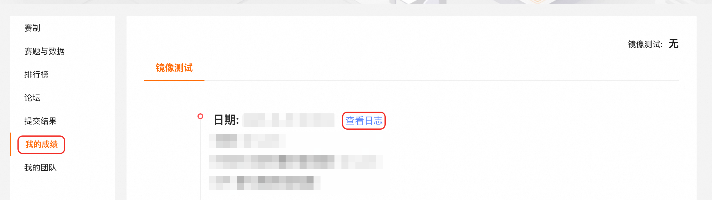

# Tianchi x PolarDB: Tuning PostgreSQL pgvector

本次比赛的目的是优化 PolarDB-for-PostgreSQL pgvector 插件，以获取更高的向量索引构建与向量查询性能。

## 整体测评流程

1.  进入竞赛仓库，点击 Fork 按键，Fork 竞赛仓库
    

    
2.  进入 Fork 仓库，将仓库权限设置为 **私有**，赛事结束前禁止公开参赛代码
    

    
3.  将 polardb-tianchi (polardbtianchi) 用户添加为参赛代码仓库的 **观察者**
    

    
4.  创建配置文件[`config.conf`](./ROUND1/config.conf)，配置文件参考`ROUND1`下的`config.conf`文件。将配置文件上传到天池测试平台中，点击提交进行测评
    

    
5.  等待测试完成，运行结果与运行日志可以点击「我的成绩」查看
    

### 决赛测评流程

决赛的提交方式与初赛基本相同，只需要将配置文件上传到天池平台并点击提交，即可进行评测。配置文件格式参考[`ROUND2/config`](./ROUND2/config)下的配置文件。

*   决赛可以提交两个配置文件，其中[`config.conf`](./ROUND2/config/config.conf)包含代码库地址、提交 ID、索引构建与向量查询等参数项，主要控制代码与索引构建、向量查询等流程；[`postgresql.conf`](./ROUND2/config/postgresql.conf)包含数据库参数项，主要控制数据库的运行行为

*   选手提交代码测试时，需要进入 ROUND2 目录，将 config 文件夹压缩为 zip 文件上传，压缩命令为`zip -r config.zip config/`

*   提交入口与初赛相同，为天池平台->提交结果->配置路径->上传 TCCFile ->提交，返回结果可以在我的成绩中查看。

*   功能测试与性能测试通过后，系统将返回成绩，如果未通过测试会返回报错信息。参赛者每天有若干次机会提交评测（具体次数见天池页面），如果评测出错则不计入次数，排行榜取最优成绩排名，具体计分逻辑见 [ROUND2/README.md](./ROUND2/README.md) 文件。

## 本地自测流程

本地自测流程详见[`test/`](./test/)本地自测目录下的 README 文件，大致流程如下：

1. 初始化测试环境并下载数据集

2. 拉取开发镜像并运行容器

3. 编译并配置数据库

4. 插入数据并建立索引

5. 运行基准测试

## 目录结构

*   `ROUND1/`天池数据库大赛初赛相关资料

*   `ROUND2/`天池数据库大赛决赛相关资料
    
*   `polardb/`PolarDB-for-PostgreSQL 代码，基于 [ApsaraDB/PolarDB-for-PostgreSQL at polardb-competition-2025](https://github.com/ApsaraDB/PolarDB-for-PostgreSQL/tree/polardb-competition-2025)

*   `test/`本地自测目录，选手可以进入该目录进行本地测试
    

## 相关资料
*   [PGVector 的背景、原理、使用方法 - 云原生数据库 PolarDB - 阿里云帮助中心](https://help.aliyun.com/zh/polardb/polardb-for-postgresql/pgvector)

*   [pgvector 插件简单使用 - 云原生数据库 PolarDB - 阿里云帮助中心](https://help.aliyun.com/zh/polardb/polardb-for-postgresql/getting-started-pgvector)
