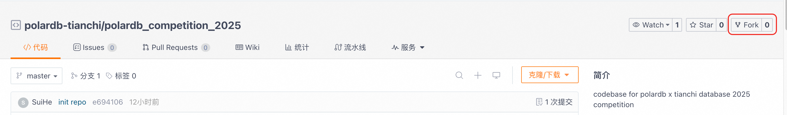
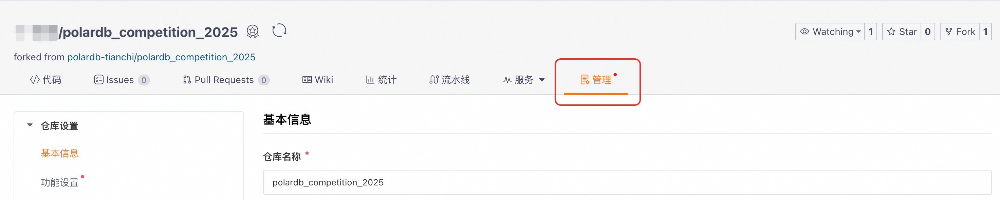
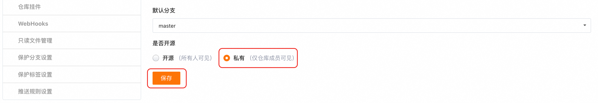
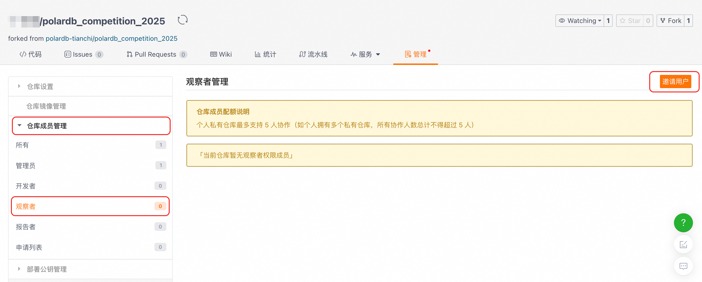
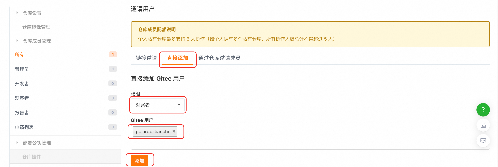
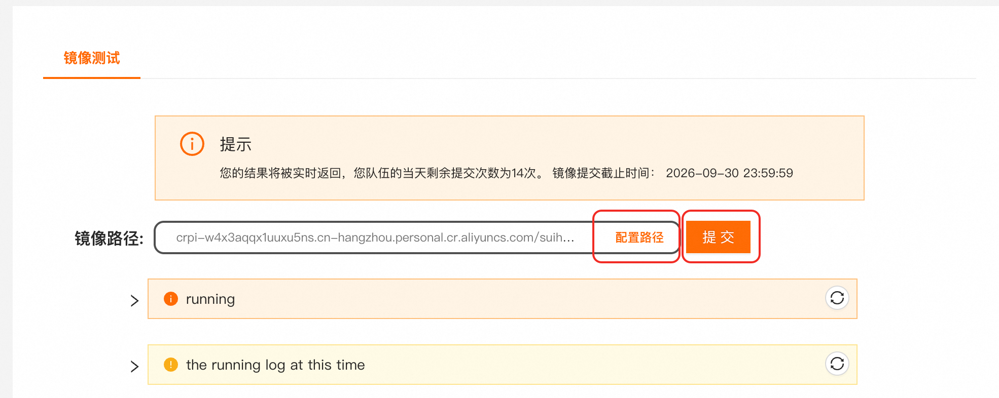
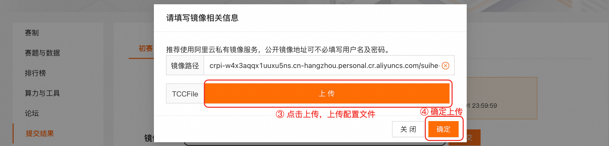
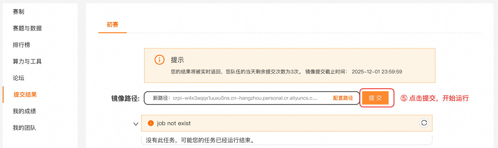

# Tianchi x PolarDB: Tuning PostgreSQL pgvector

本次比赛的目的是优化 PolarDB-for-PostgreSQL pgvector 插件，以获取更高的向量索引构建与向量查询性能。

## 测评流程

1.  进入竞赛仓库，点击 Fork 按键，Fork 竞赛仓库
    

    
2.  进入 Fork 仓库，将仓库权限设置为 **私有**，赛事结束前禁止公开参赛代码
    

    
3.  将 polardb-tianchi (polardbtianchi) 用户添加为参赛代码仓库的 **观察者**
    

    
4.  创建配置文件`config.conf`并将配置文件上传到天池测试平台中，点击提交进行测评
    

    
5.  等待测试完成，运行结果与运行日志可以点击「我的成绩」查看
    

## 本地自测流程

本地自测流程详见`test/`本地自测目录下的 README 文件，大致流程如下：

1. 初始化测试环境并下载数据集

2. 拉取开发镜像并运行容器

3. 编译并配置数据库

4. 插入数据并建立索引

5. 运行基准测试

## 目录结构

*   `ROUND1/`天池数据库大赛初赛相关资料
    
*   `polardb/`PolarDB-for-PostgreSQL 代码，基于 [ApsaraDB/PolarDB-for-PostgreSQL at polardb-competition-2025](https://github.com/ApsaraDB/PolarDB-for-PostgreSQL/tree/polardb-competition-2025)

*   `test/`本地自测目录，选手可以进入该目录进行本地测试
    

## 相关资料
*   [PGVector 的背景、原理、使用方法 - 云原生数据库 PolarDB - 阿里云帮助中心](https://help.aliyun.com/zh/polardb/polardb-for-postgresql/pgvector)

*   [pgvector 插件简单使用 - 云原生数据库 PolarDB - 阿里云帮助中心](https://help.aliyun.com/zh/polardb/polardb-for-postgresql/getting-started-pgvector)
